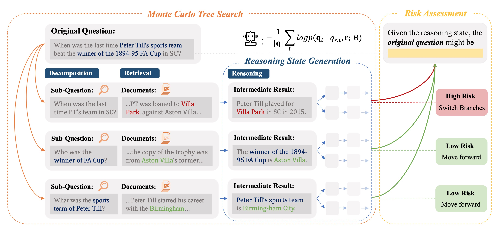

# ARise: Towards Knowledge-Augmented Reasoning via Risk-Adaptive Search

ARise is an advanced reasoning framework that implements Monte Carlo Tree Search (MCTS) for complex question answering tasks. The system decomposes complex questions into manageable sub-questions, retrieves relevant information, and synthesizes a final answer through iterative search and risk-assessment.

**Project homepage**: [https://opencausalab.github.io/ARise/](https://opencausalab.github.io/ARise/)



## Features

- **Iterative Refinement through Decomposition**: Breaks down complex reasoning tasks into manageable steps, enabling more precise and controlled reasoning processes.
- **Retrieval-then-Reasoning Approach**: Augments LLMs with fine-grained knowledge retrieval to enhance reasoning capabilities with external information.
- **Monte Carlo Tree Search (MCTS)**: Expands linear reasoning into tree-based exploration, mitigating error propagation by allowing backtracking when necessary.
- **Risk-Adaptive Search**: Employs Bayesian risk minimization to dynamically evaluate reasoning states and optimize search strategies.
- **Dynamic Path Exploration**: Enables exploration of multiple reasoning paths simultaneously, focusing computational resources on the most promising directions.

## Project Structure

```
ARise/
├── asset/                  # Project assets
│   ├── pipe.png            # Pipeline diagram
│   ├── com.png             # Comparison diagram
│   └── res.png             # Results visualization
├── src/                    # Core implementation
│   ├── base.py             # Base reasoning functions
│   ├── mcts.py             # Monte Carlo Tree Search implementation
│   ├── node.py             # Tree node definition
│   └── task.py             # Task definition and execution
├── utils/                  # Utility functions
│   ├── extract.py          # Data extraction utilities
│   ├── inference_model.py  # Model inference wrapper
│   ├── prompts.py          # Prompt templates
│   ├── rag.py              # Retrieval-augmented generation
│   ├── value_function.py   # Value functions for MCTS
│   ├── value_model.py      # Value model implementation
│   ├── verify.py           # Verification utilities
│   └── wrap.py             # Prompt wrapping utilities
├── run.py                  # Main execution script
└── nltk_data.zip           # NLTK data package
```

## Requirements

- Python 3.12+
- PyTorch
- Transformers
- NLTK (included as nltk_data.zip)
- Other dependencies as specified in pyproject.toml

## Installation

1. Clone the repository:
   ```bash
   git clone https://github.com/OpenCausaLab/ARise.git
   cd ARise
   ```

2. Install dependencies:
   ```bash
   pip install -e .
   ```

3. Extract NLTK data:
   ```bash
   unzip nltk_data.zip -d $HOME
   ```

## Usage

Run the main script with:

```bash
python run.py
```

The script will:
1. Load the dataset from the specified path
2. Initialize the language model
3. Process each example using the specified reasoning strategy
4. Evaluate the results and save outputs

## Configuration

Key parameters can be configured in the `MCTSTask` class:

- `time_limit`: Time limit for search in milliseconds
- `iteration_limit`: Maximum number of iterations
- `exploration_constant`: UCT exploration constant
- `multihops`: Number of sub-queries
- `total_depth`: Total depth of the search tree
- `temperature`: Sampling temperature
- `run_mode`: Reasoning strategy (MCTS, zero-shot, etc.)
- `value_mode`: Value function mode (risk, similarity, etc.)

## Evaluation

The system evaluates performance using:
- Exact match accuracy
- F1 score for supporting facts

## Citation

If you use ARise in your research, please cite:

```
@article{zhang2025arise,
  title   = {ARise: Towards Knowledge-Augmented Reasoning via Risk-Adaptive Search},
  author  = {Yize Zhang and Tianshu Wang and Sirui Chen and Kun Wang and Xingyu Zeng and Hongyu Lin and Xianpei Han and Le Sun and Chaochao Lu},
  year    = {2025},
  journal = {arXiv preprint arXiv:2504.10893}
}
```
